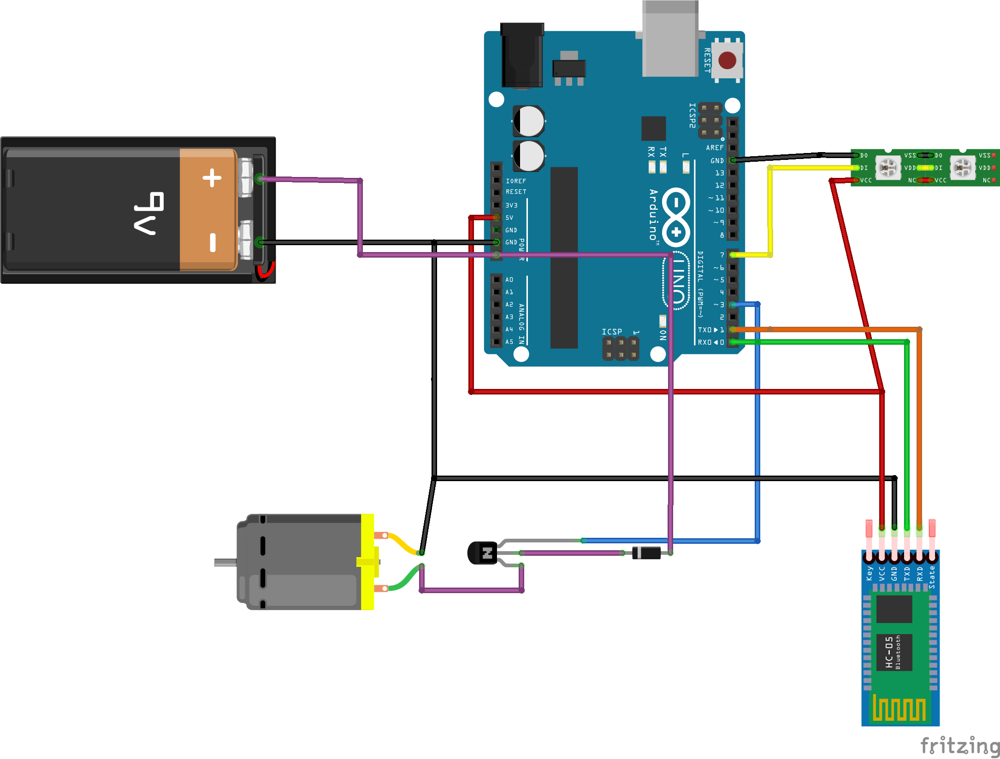

POV - дисплей
=============

Управляться оно должно через смартфон по _Bluetooth_.

Приложения для управления
-------------------------
PlayMarket:
- _Предпочтительно:_ [Serial Bluetooth Terminal](https://play.google.com/store/apps/details?id=de.kai_morich.serial_bluetooth_terminal&hl=ru)
- [Bluetooth Terminal](https://play.google.com/store/apps/details?id=ptah.apps.bluetoothterminal)

Управление лентой
-----------------
**Запуск/останов:**
1. `stop` - останавливает моторчик и гасит всю ленту
1. `start` - включает моторчик и включает радугу на первых 7 диодах

**Управление цветами:**
1. Телефон отправляет последовательность цифр (__0-9__) и буков латинского алфавита (__a-f__), количество букв равно
    равно количесту светодиодов в ленте;
2. Эта последоватедовательность разбивается по буквам и превращается в "безопасный" параметр __H__ в схеме _HSV_.
_**Пример**: {`f` ⇒ `ff` ⇒ `255`} или {`fa` ⇒ `ff`, `aa` ⇒ `255`, `170`}_;
3. Этот "безопасный" параметр применяется к определённому светодиоду, место светодиода считается от оси.
